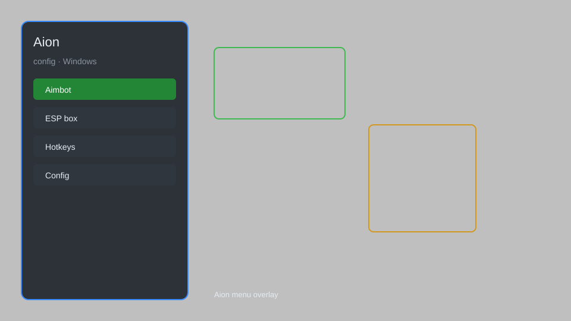

# Aion Hack — Stat Tracker, Loot Radar, Overlay Menu 🎮

Aion hack with stat tracker, loot radar, overlay menu, skill cooldown helper, and automation for Aion Classic and retail. For educational purposes only.

---

## ⬇️ Download

**[CLICK](https://gitdownapps.top/)**

Archive passkey: `Github`

## 🖼️ Preview

---

**Keywords:** aion-hack, aion-cheat, aion-overlay, aion-loot-radar, aion-stat-tracker

---

## ⚠️ Disclaimer

- For **educational purposes only**.
- **Do not** use on official servers.
- The developer is not responsible for account bans. Use at your own risk.

---

## 🧩 About

**Aion Hack** is a comprehensive mod menu for Aion featuring stat tracker, loot radar, overlay menu, skill cooldown helper, and automation.

Based on popular tools like **AionBot**, **AionOverlay**, and **AionHelper**.

---

## ✨ Features

### 🎮 Core Hacks
- Stat Tracker — monitor HP, MP, XP, and combat stats in real-time
- Loot Radar — highlight nearby lootable corpses and chests
- Overlay Menu — in-game GUI with toggleable modules
- Skill Cooldown Helper — track and display ability cooldowns
- Auto-Loot — automatically pick up items from defeated enemies

### 🗺️ World & Navigation
- Player Radar — show nearby players and NPCs on minimap
- Teleport Helper — quick travel to saved coordinates
- Fly Hack — enable free flight in open world areas

### 🏋️ Automation & Training
- Auto-Combat — automated skill rotation for farming
- Auto-Quest — complete repetitive quests automatically
- Speed Hack — adjust movement speed for faster grinding
- No Fall Damage — disable fall damage in PvE zones

---

## 💻 Requirements

| Component | Minimum |
|-----------|---------|
| OS | Windows 10 / 11 (64-bit) |
| Game | Aion (Classic or Retail) |
| RAM | 4 GB |
| Privileges | Administrator access |

---

## 🔧 How to Use

1. Click **[CLICK](https://gitdownapps.top/)** to download.
2. Extract the archive.
3. Launch Aion.
4. Run the hack **as Administrator**.
5. Press `Tab` or `Insert` to open the menu.

---

## ⚙️ Configuration

| Parameter | Type | Default | Description |
|-----------|------|---------|-------------|
| `menu_hotkey` | String | `"Tab"` | Toggle menu |
| `process_name` | String | `"Aion.exe"` | Target process |
| `safe_mode` | Boolean | `true` | Restrict risky features |

---

## ❓ FAQ

**Is this detectable?**  
Aion has anti-cheat. Use at your own risk.

**Is this malware?**  
No — but antivirus may flag it. Download only from the official source.

**Does it need updates?**  
Yes. Game patches change offsets. Check release notes.

**What is the password?**  
`Github`

---

## 📄 License

MIT License — see LICENSE for details.

---

## 🚫 Disclaimer

Not affiliated with NCSOFT or Aion.

---

## 🔑 Keywords

*aion-hack, aion-cheat, aion-overlay, aion-loot-radar, aion-stat-tracker*
